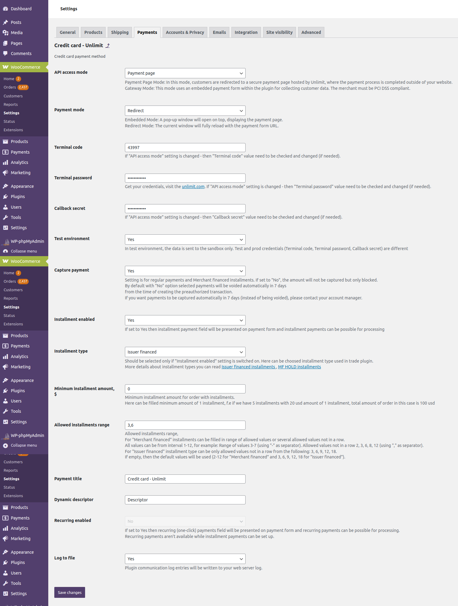
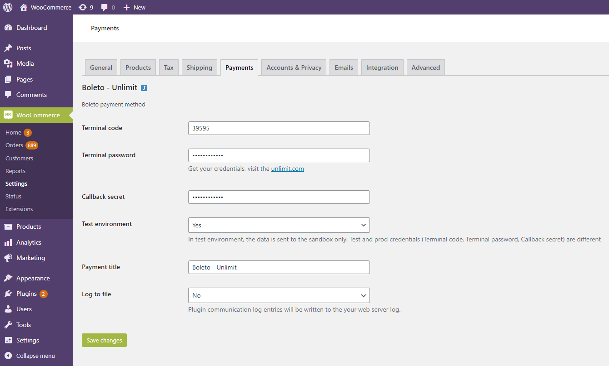

# Unlimit WooCommerce plugin

## Overview
**Unlimit WooCommerce** engine plugin allows merchants to make payments, installment payments, and refunds (credit memos) using the WooCommerce platform.
Additionally, the plugin supports cancellation (void) transactions and payment capture for preauthorized payments. 

**Unlimit WooCommerce** plugin is able to work in following modes:
* Gateway mode
* Payment Page mode

### Requirements
**Unlimit WooCommerce** plugin is open-source and supports:

 * The WooCommerce engine (version 7.3.0 or greater)
 * MySQL version 5.6 or greater OR MariaDB version 10.1 or greater
 * PHP 7.4 and up to PHP 8.1 according to the official [WooCommerce recommendations](https://woocommerce.com/document/server-requirements/)
 
### Supported payment methods

Supported payment methods, the countries where those methods are available in, and their capabilities are displayed in the table below:

| Payment method | Country  | Payment | Installment | Void/Cancel | Online refund | Offline refund |
|----------------|----------|---------|-------------|-------------|---------------|----------------|
| Credit card    | Global   | Yes     | Yes         | Yes         | Yes           | Yes            |
| Boleto         | Brazil   | Yes     | No          | No          | No            | Yes            |
| Google Pay     | Global   | Yes     | No          | No          | Yes           | Yes            |
| MB WAY         | Portugal | Yes     | No          | No          | Yes           | Yes            |
| Multibanco     | Portugal | Yes     | No          | No          | No            | Yes            |
| PayPal         | Global   | Yes     | No          | No          | Yes           | Yes            |
| Pix            | Brazil   | Yes     | No          | No          | No            | Yes            |
| SEPA Instant   | Europe   | Yes     | No          | No          | No            | Yes            |
| SPEI           | Mexico   | Yes     | No          | No          | No            | Yes            |

### Supported languages:

- English (EN)
- Portuguese (PT)
- Spanish (ES)

## Installation
Installation process explains how to install the WooCommerce plugin:

1. Download the latest version of WooCommerce plugin from Unlimit's GitHub [repository](https://github.com/cardpay/woocommerce-plugin).

2. Go to the WordPress root directory.

3. Copy the plugin folder to the WordPress root directory. As a result, `./wp-content/plugins/unlimit` directory should be presented.

4. Activate the plugin in the WordPress admin panel, go to **Plugins** - **Unlimit payments for WooCommerce** and click **Activate**.

**Unlimit WooCommerce** plugin was successfully installed and activated.

## Configuration
Configuration process explains how to set up and configure the WooCommerce plugin to accept payments in supported payment methods.

### Basic settings
Begin with the following basic settings:

1. Log in to Admin panel of the **Unlimit WooCommerce** plugin (using admin credentials).

2. Navigate to **WooCommerce** > **Settings** > **Payments** (payment methods settings).

3. To enable payment methods in the **WooCommerce** plugin:
    - Credit card
    - Boleto
    - Google Pay
    - MB WAY
    - Multibanco
    - PayPal
    - Pix
    - SEPA Instant
    - SPEI

* First, access payment methods you want to enable via Unlimit support (it's a part of merchant onboarding process -
see [here](https://www.unlimit.com/integration/)). 
* Then enable the payment method by switching toggle to the 'On' position

#### Payment methods settings

##### **Credit card**

To enable payments via **Credit card** complete the following steps:

 * **API access mode:**
    * Set to **Payment page** for cases when payment page by Unlimit in iFrame is used for customer data collecting.
    * Set to **Gateway** for cases when embedded payment form in plugin is used for customer data collecting.
 * Set **API access mode** to either select using the **Payment page** or process payments directly by **Gateway**.
 * Set **Terminal code**, **Terminal password**, **Callback secret** values - it should be merchant credentials in Unlimit APIv3 for this payment method (how to obtain credentials see [here](https://www.unlimit.com/integration/)).
 * Test environment:
    * Set to **Yes** for Sandbox environment (for test purposes).
    * Set to **No** for Production environment.
 * **Payment title** - fill in the name of the payment method, will be presented for the customer in checkout.
 * **Capture payment**:
   * Set to **Yes** for completion payment automatically (one phase payment).
   * Set to **No** for two phases payment: the amount will not be captured but only blocked. With **No** option selected,  payments will be voided automatically in 7 days from the time of creating the preauthorized transaction. If you want payments to be captured automatically in 7 days (instead of being voided), please contact your account manager.

 * **Installment enabled** - this setting enables installment payments possibility.
   * Set to **Yes** - installment payments are enabled, number of installments are available for selection in payment form.
   * Set to **No** - installment payments are disabled.
 * **Installment type** - this setting allows to select between available installment types. Choose the required installment type between **Merchant financed** or **Issuer financed**. Both selections are available only for **API access mode** - **Gateway** parameter, while **Payment page** selection allows only **Issuer financed** type of installment.
 * **Minimum installment amount** - allows to set the amount of order with installments with the pre-set currency parameter.
 * **Allowed installments range** - allows to split payment into 2-12 installments for **Merchant financed** type or 3, 6, 9, 12 and 18 installments for **Issuer financed** type. Each installment in 30 days period. This parameter is accessible both for **Merchant financed** and **Issuer financed** types.
 * **Payment title** - allows to set the payment title.
 * **Ask CPF** - set to **Yes** if **CPF (Brazilian Tax Id)** is required for the customer in checkout.
 * **Dynamic descriptor** - short description of the service or product, see `dynamic_descriptor` API field in [API documentation](https://integration.unlimit.com/api-reference/b5e0a98548e2b-payment-request-payment-data).
* **Log to file** - enables saving payment method messages to WooCommerce plugin system log.

##### **Boleto**

To enable payments via **Boleto** complete the following steps:
	

* Set **Terminal code**, **Terminal password**, **Callback secret** values - it should be merchant credentials in Unlimit API v3 for this payment method (how to obtain credentials see [here](https://www.unlimit.com/integration/)).
* **Test environment**:
    * Set to **Yes** for Sandbox environment (for test purposes).
    * Set to **No** for Production environment.
* **Payment title** - fill in the name of the payment method, will be presented for the customer in checkout.
* **Log to file** - enables saving payment method messages to WooCommerce plugin system log.

##### **Google Pay**
To enable payments via **Google Pay** complete the following steps:

* Set **Terminal code**, **Terminal password**, **Callback secret** values - it should be merchant credentials in
  Unlimit APIv3 for this payment method (how to obtain credentials see [here](https://www.unlimit.com/integration/))
* **Test environment:**
    * Set to **Yes** for Sandbox environment (for test purposes).
    * Set to **No** for Production environment.
* **Payment title** - fill in the name of the payment method, which will be presented for the customer in checkout.
* **Log to file** - enables saving payment method messages to WooCommerce plugin system log.
* **Google merchant ID** - Merchant ID, provided by Google.

##### **MB WAY**
To enable payments via **MB WAY** complete the following steps:

* **API access mode:**
    * Set to **Payment page** for cases when payment page by Unlimit in iFrame is used for customer data collecting.
    * Set to **Gateway** for cases when embedded payment form in plugin is used for customer data collecting.
* Set **Terminal code**, **Terminal password**, **Callback secret** values - it should be merchant credentials in
  Unlimit APIv3 for this payment method (how to obtain credentials see [here](https://www.unlimit.com/integration/))
* **Test environment:**
    * Set to **Yes** for Sandbox environment (for test purposes).
    * Set to **No** for Production environment.
* **Payment title** - fill in the name of the payment method, which will be presented for the customer in checkout.
* **Log to file** - enables saving payment method messages to WooCommerce plugin system log.

##### **Multibanco**
To enable payments via **Multibanco** complete the following steps:

* **API access mode:**
    * Set to **Payment page** for cases when payment page by Unlimit in iFrame is used for customer data collecting.
    * Set to **Gateway** for cases when embedded payment form in plugin is used for customer data collecting.
* Set **Terminal code**, **Terminal password**, **Callback secret** values - it should be merchant credentials in
  Unlimit APIv3 for this payment method (how to obtain credentials see [here](https://www.unlimit.com/integration/))
* **Test environment:**
    * Set to **Yes** for Sandbox environment (for test purposes).
    * Set to **No** for Production environment.
* **Payment title** - fill in the name of the payment method, which will be presented for the customer in checkout.
* **Log to file** - enables saving payment method messages to WooCommerce plugin system log.

##### **PayPal**
To enable payments via **PayPal** complete the following steps:

* **API access mode:**
    * Set to **Payment page** for cases when payment page by Unlimit in iFrame is used for customer data collecting.
    * Set to **Gateway** for cases when embedded payment form in plugin is used for customer data collecting.
* Set **Terminal code**, **Terminal password**, **Callback secret** values - it should be merchant credentials in
  Unlimit APIv3 for this payment method (how to obtain credentials see [here](https://www.unlimit.com/integration/))
* **Test environment:**
    * Set to **Yes** for Sandbox environment (for test purposes).
    * Set to **No** for Production environment.
* **Payment title** - fill in the name of the payment method, which will be presented for the customer in checkout.
* **Log to file** - enables saving payment method messages to WooCommerce plugin system log.

##### **Pix**
To enable payments via **Pix** complete the following steps:

* Set **Terminal code**, **Terminal password**, **Callback secret** values - it should be merchant credentials in
  Unlimit APIv3 for this payment method (how to obtain credentials see [here](https://www.unlimit.com/integration/))
* **Test environment:**
    * Set to **Yes** for Sandbox environment (for test purposes).
    * Set to **No** for Production environment.
* **Payment title** - fill in the name of the payment method, which will be presented for the customer in checkout.
* **Log to file** - enables saving payment method messages to WooCommerce plugin system log.

##### **SEPA Instant**
To enable payments via **SEPA Instant** complete the following steps:

* **API access mode:**
    * Set to **Payment page** for cases when payment page by Unlimit in iFrame is used for customer data collecting.
    * Set to **Gateway** for cases when embedded payment form in plugin is used for customer data collecting.
* Set **Terminal code**, **Terminal password**, **Callback secret** values - it should be merchant credentials in
  Unlimit APIv3 for this payment method (how to obtain credentials see [here](https://www.unlimit.com/integration/))
* **Test environment:**
    * Set to **Yes** for Sandbox environment (for test purposes).
    * Set to **No** for Production environment.
* **Payment title** - fill in the name of the payment method, which will be presented for the customer in checkout.
* **Log to file** - enables saving payment method messages to WooCommerce plugin system log.

##### **SPEI**
To enable payments via **SPEI** complete the following steps:

* **API access mode:**
    * Set to **Payment page** for cases when payment page by Unlimit in iFrame is used for customer data collecting.
    * Set to **Gateway** for cases when embedded payment form in plugin is used for customer data collecting.
* Set **Terminal code**, **Terminal password**, **Callback secret** values - it should be merchant credentials in
  Unlimit APIv3 for this payment method (how to obtain credentials see [here](https://www.unlimit.com/integration/))
* **Test environment:**
    * Set to **Yes** for Sandbox environment (for test purposes).
    * Set to **No** for Production environment.
* **Payment title** - fill in the name of the payment method, which will be presented for the customer in checkout.
* **Log to file** - enables saving payment method messages to WooCommerce plugin system log.

That's it! The selected payment methods are successfully enabled in the checkout.

### Payment notification configuration
This process explains how to set up Order statuses for payment notifications:

1. Log in to the Unlimit’s [Merchant account](https://sandbox.cardpay.com/ma) with Merchant credentials (obtaining of merchant credentials is a part of merchant onboarding process - see details [here](https://www.unlimit.com/integration/)).
2. Go to **Wallet Settings** and click on the Wallet's ID (Settings / Wallet settings / choose specific wallet id / Callbacks / JSON callback URL).
3. Fill in the JSON Callback URL field with:

`https://<wordpress_domain>/index.php/wc-api/?wc-api=unlimit_callback`

where _<wordpress_domain>_ is website domain.

The notification statuses have been successfully configured.

## Supported post-payment operations
Unlimit WooCommerce plugin supports the following post-payment operations:

 * Void (Cancellation).
 * Capture of the Payment.
 * Online Refund.
 * Offline Refund.
 
### Cancellation (void) / Capture of the payment
Cancellation (void) / capture of the payment only works for **Credit card** payment method.
It's available only for orders which were processed by a certain payment method configuration (**Capture payment** is set to **No**). 

If **Capture payment** is set to **Yes** - an order will be completed without any user actions in WooCommerce Admin Panel.

#### Capture of the payment
To Capture of the preathorized payment, navigate to **Orders** and choose the **Order** in **On Hold** status for capture payment.

Edit the quantity of items if needed in the **Item** block (change the quantity of the items and **complete order partially**).

Then click the **Capture** button.

Click **Yes** inside the presented pop-up window in order to proceed with the payment operation processing.

The status of the order is changed to **Processing**.

#### Cancel (void) the payment
To cancel (void) the payment, navigate to **Orders** and choose the **Order** for cancel (void) payment.

Click **Cancel**. 

In the presented pop-up window for cancelling of the payment, click **Ok**.

Order status is changed to **Cancelled**.

### Refund (online refund)

**Refund** operation is supported only for following payment methods:
* Credit card (payments and "Issuer financed" installment payments)
* Google Pay
* MB WAY
* PayPal

For creating a **Refund online** navigate to **Orders** and choose any **Order** in status **Processing**.

Click the **Refund** button and fill in the quantity of items for a refund (change the quantity of items for **partial refund**).

Fill in the delivery amount of the refund - refund amount is calculated automatically.

Click the **Refund via Credit card - Unlimit** button after the refund amount calculation is complete.

Click **Yes** in the presented refund confirmation pop-up window.

After successful full refund, the status of the order is changed to **Refunded**.

### Refund offline

**Refund offline** is the operation when refund is created offline and amount of order should be returned manually in offline with cash only.

**Refund offline** is possible for all supported payment methods in WooCommerce plugin.

Refer to [official WooCommerce documentation](https://woocommerce.com/document/woocommerce-refunds/#section-4) in order to see the detailed information regarding refund offline operation.
