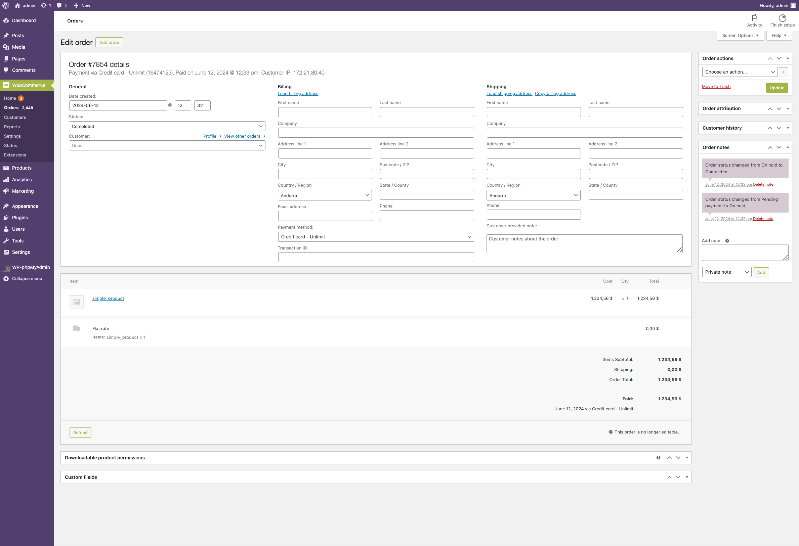
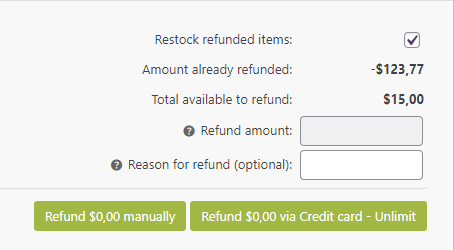

# Unlimint WooСommerce plugin
## Overview

Unlimint WooСommerce engine plugin allows merchants to make payments, installment payments and refunds using the WooСommerce platform.

Also, for preauthorized payments plugin supports cancellation (void), capture of the payment or installment payment, payment refund.

### Requirements

Unlimint WooСommerce plugin is open-source and supports:

 * The WooСommerce engine (version 5.9.0)
 * PHP 7.4 or greater, all other requirements regarding to official [WooСommerce recommendations](https://woocommerce.com/document/server-requirements/)

### Supported payment methods

 * Bank Card (Credit Card)
 * Boleto

## Installation

Installation process will explain how to install the WooСommerce plugin:

1. Download the latest version of WooСommerce plugin from Unlimint's Github [repository](https://github.com/cardpay/woocommerce-plugin)

2. Go to WordPress's root directory.

3. Copy the plugin folder to WordPress root directory. As a result, `./wp-content/plugins/unlimint` directory should be presented.

5. You need to activate the plugin in WordPress admin panel, go to **Plugins** - **Unlimint payments for WooСommerce** and click Activate

The Unlimint WooСommerce plugin was successfully installed and activated.

## Configuration

This process explains how to set up and configure the WooСommerce plugin to accept payments in supported payment methods.

### Basic settings

1. Log in into Admin panel of Unlimint WooСommerce plugin (using your admin credentials)

2. Navigate to **WooСommerce** > **Settings** > **Payments** (payment methods settings)

#### Payment methods settings

You need to enable payment methods in WooСommerce plugin (for now it's Credit Card and Boleto).

First, access the methods you want to enable by Unlimint support (it's a part of merchant onboarding process - see [here](https://www.unlimint.com/integration/))

To enable payments via **Credit Card - Unlimint** switch on **Enabled** for this payment method and do the following steps:

 * Go to **Credit Card - Unlimint** payment method

 * Set **Terminal code**, **Terminal password**, **Callback secret** values - it should be merchant credentials in Unlimint APIv3 for this payment method (how to obtain credentials see [here](https://www.unlimint.com/integration/))
 * Test environment:
    * Set to **Yes** for Sandbox environment (for test purposes)
    * Set to **No** for Production environment
 * **Payment title** - fill in the name of the payment method, will be presented for the customer in checkout
 * **Capture payment:**
   * Set to **Yes** - for completion payment automatically (one phase payment),
   * Set to **No** for two phases payment: the amount will not be captured but only blocked.  
With **No** option selected payments will be captured automatically in 7 days from the time of creating the preauthorized transaction.
 
In installment case with **No** option selected installments will be declined automatically in 7 days from the time of creating the preauthorized transaction.
 * **Installment enabled:** - this setting enables installment payments possibility
   * Set to **Yes** -installment payments are enabled, number of installments are available for selection in payment form, it's possible to split payment to 2-12 installments, each installment in 30 days period.
   * Set to **No** - installment payments are disabled
 * **Ask CPF** - set to **Yes** if you require **CPF (Brazilian Tax Id)** of your customer in checkout
 * **Dynamic Descriptor** - short description of the service or product, see `dynamic_descriptor` API field in [API documentation](https://integration.unlimint.com/#PaymentRequestPaymentData)
 * **Log to file** - there is a setting about WooСommerce plugin system log, this log file contains the plugin debug information, communication errors between plugin front-end and back-end.

To enable payments via **Boleto** payment method switch on **Enabled** for this payment method and do the following steps:

 * Go to **Boleto - Unlimint** payment method
 * Set **Terminal code**, **Terminal password**, **Callback secret** values - it should be merchant credentials in Unlimint API v3 for this payment method (how to obtain credentials see [here](https://www.unlimint.com/integration/))
 * Test environment:
    * Set to **Yes** for Sandbox environment (for test purposes)
    * Set to **No** for Production environment
 * **Payment title** - fill in the name of the payment method, will be presented for the customer in checkout
 * **Log to file** - here is a setting about WooСommerce plugin system log, this log file contains the plugin debug information, communication errors between plugin front-end and back-end. By default, it's set to **Yes**. If it will be set to **No** - log file won't be created. 

That's it! The selected payment methods are successfully enabled in the checkout.

#### Order status tab settings (mapping of the order statuses)

Mapping of the order statuses is set by default and you need to change it _only_ if you have your custom order statuses flow (not recommended to change).

**Flow of the statuses** is **unique** for each supported payment method in plugin, if you change status flow for **Credit Card - Unlimint**, status flow for **Boleto - Unlimint** payment method isn't changed. 

If you need to see or change Order mapping statuses - please Go to **CreditCard - Unlimint** or **Boleto - Unlimint** sections and choose **Order status** tab.

### Payment notification configuration

This process will explain how to set up order statuses for payment notifications:

1. Log in the Unlimint’s [Merchant account](https://sandbox.cardpay.com/ma) with your merchant credentials (obtaining of merchant credentials is a part of merchant onboarding process - see details [here](https://www.unlimint.com/integration/))
2. Go to **Wallet Settings** and click on the Wallet's ID (Settings / Wallet settings / choose specific wallet id / Callbacks / JSON callback URL)
3. Fill the JSON Callback URL field with:

`https://<wordpress_domain>/index.php/wc-api/?wc-api=unlimint_callback`

where _<wordpress_domain>_ is website domain.

The notification statuses have been successfully configured.

## Supported post-payment operations

Unlimint WooСommerce plugin supports the following post-payment operations:

 * Cancellation (void) / Capture of the preauthorized payment
 * Refund (online and offline) of the payment
 
### Cancellation (void) / Capture of the payment

Cancellation (void) / capture of the payment only works for **Credit card** payment method.
And it's available only for orders were paid with payment method configured with **Capture payment** setting is set to **No**. 

If **Capture payment** is set to **Yes** - an order will be completed without any user actions in WooСommerce Admin Panel.

#### Capture of the payment

For Capture of the preathorized payment navigate to **Orders** and choose the **Order** in **On Hold** status for capture payment.

Εdit quantity of items if needed in block **Item** (you can reduce the quantity of the items and **complete order partially**).

Then click the **Capture** button

In presented pop-up window about completion of the payment answer **Yes**

Then status of the order is changed to **Processing**.

#### Cancel (void) the payment

For cancel (void) the payment navigate to **Orders** and choose the **Order** for cancel (void) payment.

And then click **Cancel**. 

In presented pop-up window for cancelling of the payment click **Ok**

Order status is changed to **Cancelled**

### Refund (online refund)

**Refund** operation is supported only for payments (not installment payments) with payment method **Credit Card**

For creating a **Refund online** navigate to **Orders** and choose any **Order** in status **Processing**.

Click the **Refund** button and fill in quantity of items for refund (you can reduce quantity of items for **partial refund**)

And you can fill in delivery rate amount if you need to refund it, refund amount is calculated automatically.

After for the refund amount calculation click the button **Refund via Credit Card - Unlimint**.

In presented pop-up window of refund confirmation answer **Yes**

After successful full refund status of the order is changed to **Refunded**

### Refund offline

**Refund offline** is the operation when refund is created offline and amount of order should be returned manually in offline with cash only.

**Refund offline** is possible for all supported payment methods in WooСommerce plugin.

Details for refund offline you can see in [official WooСommerce documentation](https://woocommerce.com/document/woocommerce-refunds/#section-4)
