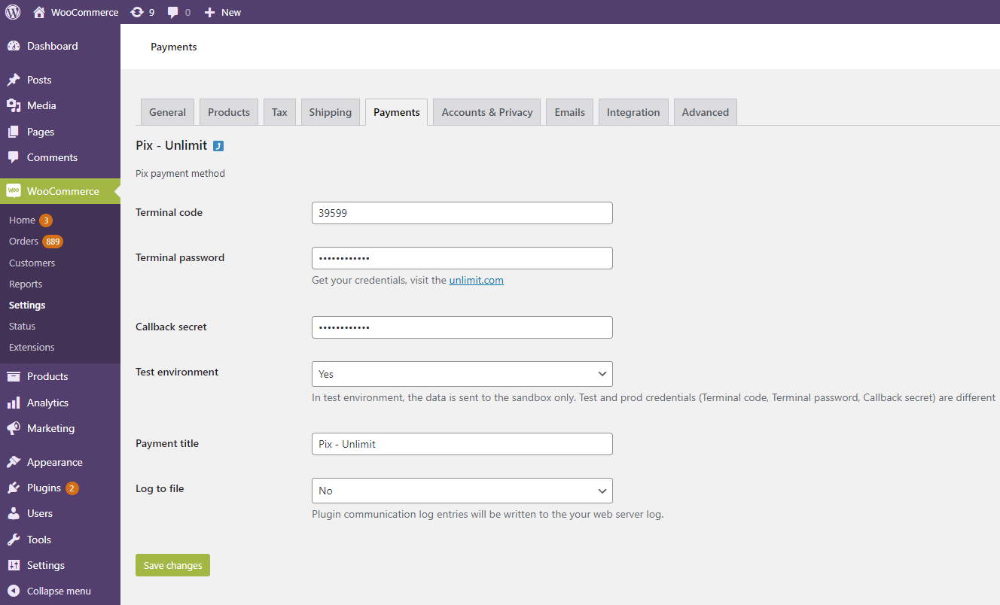
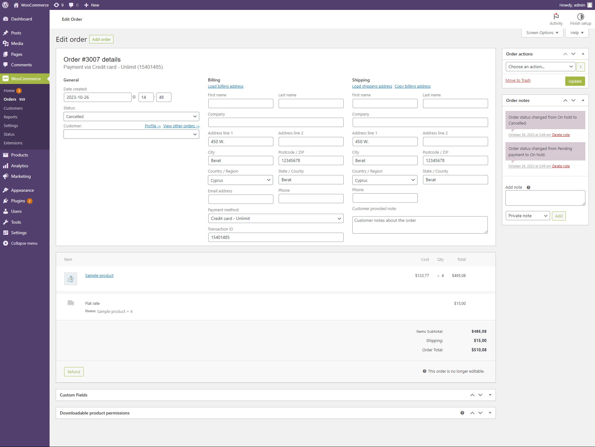

# Unlimint WooСommerce plugin

 * [Overview](#Overview)
   * [Requirements](#Requirements)
   * [Supported payment methods](#Supported_payment_methods)
 * [Installation](#Installation)
 * [Configuration](#Configuration)
   * [Basic settings](#Basic_settings)
     * [Payment methods settings](#Payment_methods_settings)
     * [Order status tab settings (mapping of the order statuses)](#Order_status_tab)
   * [Payment notification configuration](#Payment_notification_configuration)     
 * [Supported post-payment operations](#Supported_post-payment_operations)
   * [Cancellation (void) / Capture of the payment](#Cancellation_capture)
     * [Capture of the payment](#Capture_of_the_payment)
     * [Cancel (void) the payment](#Cancel_payment)
   * [Refund (online refund)](#Refund_the_payment)
   * [Refund offline](#Refund_offline)

## Overview

**Unlimint WooСommerce** engine plugin allows merchants to make payments, installment payments and refunds using the WooСommerce platform, as well as preauthorized payments plugin supports cancellation (void), capture of the payment or installment payment, payment refund.

### Requirements

**Unlimint WooСommerce** plugin is open-source and supports:

 * The WooСommerce engine (version 5.9.0)
 * PHP 7.4 or greater, all other requirements regarding official [WooСommerce recommendations](https://woocommerce.com/document/server-requirements/)

### Supported payment methods

**Unlimint WooСommerce** plugin supports the following payment methods:

 * Bank Card (Credit Card)
 * Boleto
 * Pix

## Installation

Installation process explains how to install the WooСommerce plugin:

1. Download the latest version of WooСommerce plugin from Unlimint's Github [repository](https://github.com/cardpay/woocommerce-plugin).

2. Go to the WordPress root directory.

3. Copy the plugin folder to the WordPress root directory. As a result, `./wp-content/plugins/unlimint` directory should be presented.

5. Activate the plugin in the WordPress admin panel, go to **Plugins** - **Unlimint payments for WooСommerce** and click **Activate**.

**Unlimint WooСommerce** plugin was successfully installed and activated.

## Configuration

Configuration process explains how to set up and configure the WooСommerce plugin to accept payments in supported payment methods.

### Basic settings

Begin with the following basic settings:

1. Log in to Admin panel of the **Unlimint WooСommerce** plugin (using admin credentials).

2. Navigate to **WooСommerce** > **Settings** > **Payments** (payment methods settings).

#### Payment methods settings

It is necessary to enable payment methods in the WooСommerce plugin (Bank Card (Credit Card), Boleto, Pix).

First, access the requested methods and enable them by **Unlimint support** (a part of merchant onboarding process - see [here](https://www.unlimint.com/integration/)).

To enable payments via **Credit Card - Unlimint**, switch on **Enabled** for this payment method and do the following:

 * Go to **Credit Card - Unlimint** payment method.

 * Set **API access mode** in order to select the use of **Payment page** or process payments directly by **Gateway**.
 * Set **Terminal code**, **Terminal password**, **Callback secret** values - it should be merchant credentials in Unlimint APIv3 for this payment method (how to obtain credentials see [here](https://www.unlimint.com/integration/)).
 * Test environment:
    * Set to **Yes** for Sandbox environment (for test purposes).
    * Set to **No** for Production environment.
 * **Payment title** - fill in the name of the payment method, will be presented for the customer in checkout.
 * **Capture payment**:
   * Set to **Yes** for completion payment automatically (one phase payment).
   * Set to **No** for two phases payment: the amount will not be captured but only blocked.

With **No** option selected, payments will be captured automatically in 7 days from the time of creating the preauthorized transaction.
 
In installment case with **No** option selected installments will be declined automatically in 7 days from the time of creating the preauthorized transaction.

 * **Installment enabled** - this setting enables installment payments possibility.
   * Set to **Yes** - installment payments are enabled, number of installments are available for selection in payment form.
   * Set to **No** - installment payments are disabled.
 * **Installment Type** - this setting allows to select between avaiable installment types. Choose the required installment type between **Merchant financed** or **Issuer financed**. Both selections are available only for **API access mode** - **Gateway** parameter, while **Payment page** selection allows only **Issuer financed** type of installment.
 * **Minimum total amount** - allows to set the amount of order with installments with the pre-set currrency paramenter.
 * **Maximum accepted installments** - allows to split payment into 2-12 installments for **Merchant financed** type or 3, 6, 9, 12 and 18 installments for **Issuer financed** type. Each installment in 30 days period. This parameter is accessible both for **Merchant financed** and **Issuer financed** types.
 * **Payment Title** - allows to set the payment title.
 * **Ask CPF** - set to **Yes** if **CPF (Brazilian Tax Id)** is required for the customer in checkout.
 * **Dynamic Descriptor** - short description of the service or product, see `dynamic_descriptor` API field in [API documentation](https://integration.unlimint.com/#PaymentRequestPaymentData).
 * **Log to file** - WooСommerce plugin system log setting, this log file contains the plugin debug information, communication errors between plugin front-end and back-end.

To enable payments via **Boleto** payment method, switch on **Enabled** for this payment method and do the following steps:

 * Go to **Boleto - Unlimint** payment method.
	

 * Set **Terminal code**, **Terminal password**, **Callback secret** values - it should be merchant credentials in Unlimint API v3 for this payment method (how to obtain credentials see [here](https://www.unlimint.com/integration/)).
 * Test environment:
    * Set to **Yes** for Sandbox environment (for test purposes).
    * Set to **No** for Production environment.
 * **Payment title** - fill in the name of the payment method, will be presented for the customer in checkout.
 * **Log to file** - WooСommerce plugin system log setting, this log file contains the plugin debug information, communication errors between plugin front-end and back-end. By default, it's set to **Yes**. If it will be set to **No** - the log file won't be created. 

To enable payments via **Pix** payment method, switch on **Enabled** for this payment method and do the following steps:

 * Go to **Pix - Unlimint** payment method.
 

 * Set **Terminal code**, **Terminal password**, **Callback secret** values - it should be merchant credentials in Unlimint API v3 for this payment method (how to obtain credentials see [here](https://www.unlimint.com/integration/)).
 * Test environment:
    * Set to **Yes** for Sandbox environment (for test purposes).
    * Set to **No** for Production environment.
 * **Payment title** - fill in the name of the payment method, will be presented for the customer in checkout.
 * **Log to file** - the setting of the WooСommerce plugin system log, this log file contains the plugin debug information, communication errors between plugin front-end and back-end. By default, it's set to **Yes**. If it will be set to **No** - log file will not be created.

The selected payment methods are successfully enabled in the checkout.

#### Order status tab settings (mapping of the order statuses)

Mapping of the order statuses is set by default and must be changed _only_ if Merchants have custom order statuses flow (not recommended to change).

**Flow of the statuses** is **unique** for each supported payment method in plugin. If Merchants change the status flow for **Credit Card - Unlimint**, the status flow for the **Boleto - Unlimint** or **Pix - Unlimint** payment methods is not changed.

If it is required to see or change **Order mapping** statuses for **CreditCard - Unlimint** - go to **CreditCard - Unlimint** and choose **Order status** tab.

Refer to the **Order status** tab in order to see or change the Order mapping statuses for **Boleto - Unlimint**.

Refer to the **Order status** tab in order to see or change the Order mapping statuses for **Pix - Unlimint**.

### Payment notification configuration

This process explains how to set up Order statuses for payment notifications:

1. Log in to the Unlimint’s [Merchant account](https://sandbox.cardpay.com/ma) with Merchant credentials (obtaining of merchant credentials is a part of merchant onboarding process - see details [here](https://www.unlimint.com/integration/)).
2. Go to **Wallet Settings** and click on the Wallet's ID (Settings / Wallet settings / choose specific wallet id / Callbacks / JSON callback URL).
3. Fill in the JSON Callback URL field with:

`https://<wordpress_domain>/index.php/wc-api/?wc-api=unlimint_callback`

where _<wordpress_domain>_ is website domain.

The notification statuses have been successfully configured.

## Supported post-payment operations

Unlimint WooСommerce plugin supports the following post-payment operations:

 * Cancellation (void) / Capture of the preauthorized payment.
 * Refund (online and offline) of the payment.
 
### Cancellation (void) / Capture of the payment

Cancellation (void) / capture of the payment only works for **Credit card** payment method.
It's available only for orders which were processed by a certain payment method configuration (**Capture payment** is set to **No**). 

If **Capture payment** is set to **Yes** - an order will be completed without any user actions in WooСommerce Admin Panel.

#### Capture of the payment

For Capture of the preathorized payment, navigate to **Orders** and choose the **Order** in **On Hold** status for capture payment.

Εdit the quantity of items if needed in the **Item** block (change the quantity of the items and **complete order partially**).

Then click the **Capture** button.

Click **Yes** inside the presented pop-up window in order to proceed with the payment operation processing.

The status of the order is changed to **Processing**.

#### Cancel (void) the payment

For cancel (void) the payment, navigate to **Orders** and choose the **Order** for cancel (void) payment.

Click **Cancel**. 

In the presented pop-up window for cancelling of the payment, click **Ok**.

Order status is changed to **Cancelled**.

### Refund (online refund)

**Refund** operation is supported only for payments and for installment payments (only with "Issuer financed" installment type in plugin settings and with **Credit Card** payment method).

For creating a **Refund online** navigate to **Orders** and choose any **Order** in status **Processing**.

Click the **Refund** button and fill in the quantity of items for a refund (change the quantity of items for **partial refund**).

Fill in the delivery rate amount of the refund - refund amount is calculated automatically.

Click the **Refund via Credit Card - Unlimint** button after the refund amount calculation is complete.

Click **Yes** in the presented refund confirmation pop-up window.

After successful full refund, the status of the order is changed to **Refunded**.

### Refund offline

**Refund offline** is the operation when refund is created offline and amount of order should be returned manually in offline with cash only.

**Refund offline** is possible for all supported payment methods in WooСommerce plugin.

Refer to [official WooСommerce documentation](https://woocommerce.com/document/woocommerce-refunds/#section-4) in order to see the detailed information regarding refund offline operation.
